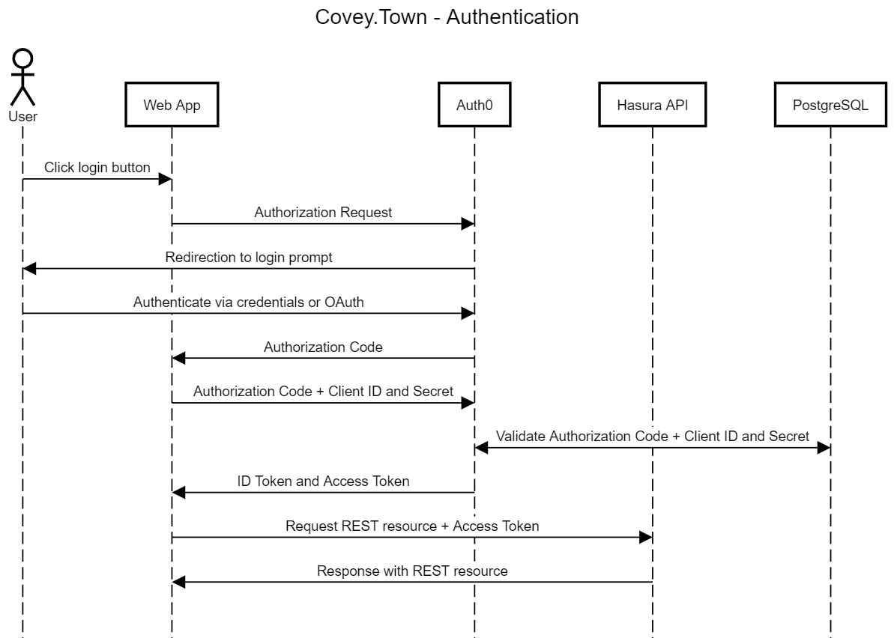
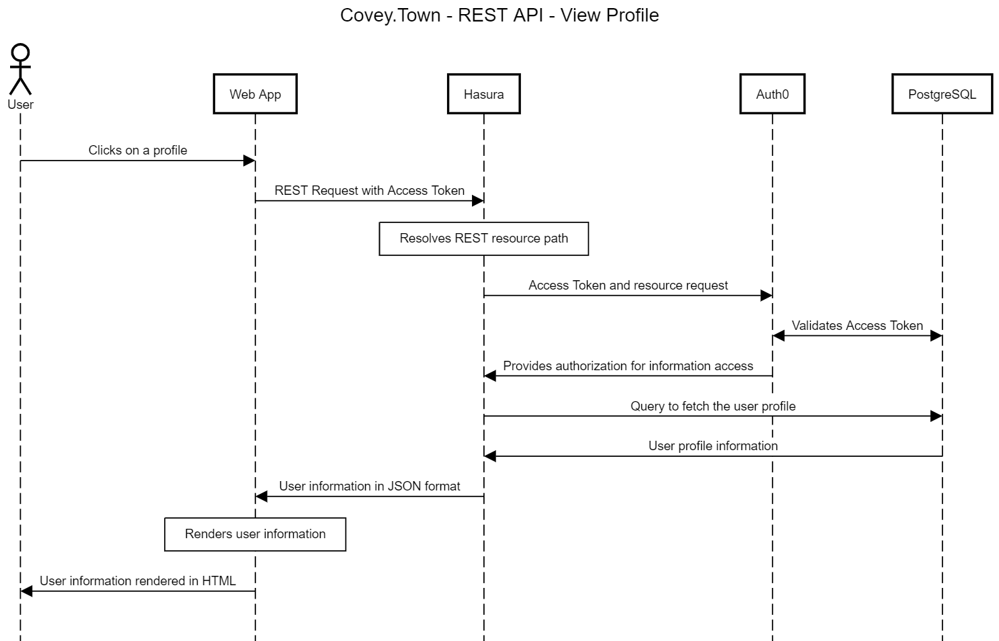
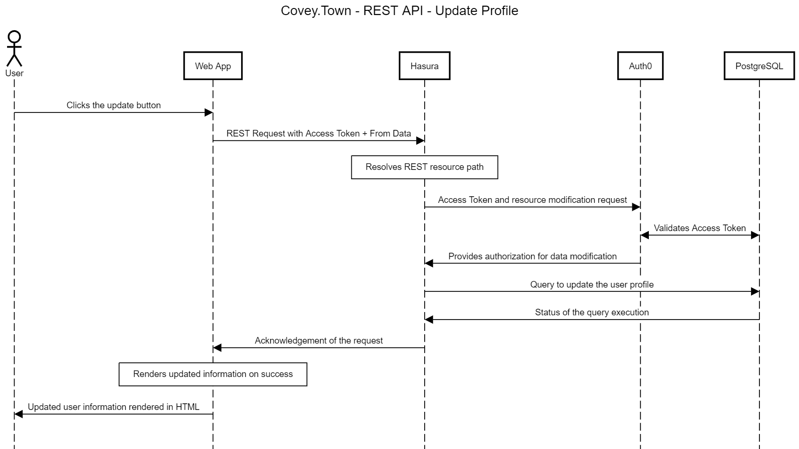

# Design

The backend is deployed on [Hasura](https://hasura.io/), with [PostgreSQL](https://www.postgresql.org/) database for user information. The database stores profile information as well as authentication information. For abstraction of Authentication and Authorization process, we integrated [Auth0](https://auth0.com/) with the Hasura and the database.

## Authentication

We use Token Authentication with JWT to control access to Covey.Town as well as to limit authorization to access and modify user data.

## REST APIs

Every REST request has to have a Bearer token provided by the authentication server. The backend verifies the access to the particular resource and returns the data or an appropriate error.

### View Profile

### Update Profile

Similar sequence follows for the rest of the APIs, too.

# Changes To The Existing Codebase

## Backend

Backend code did not require any changes for our use cases. As we implemented user profiles on Hasura and authentication using Auth0, we found the existing Covey.Town backend to be adequate as-is to integrate our new features.

After the user is logged in as shown above, they are allowed to join a room as before their profile information is used to join the room.

We added tests for our Hasura application to the backend code, which tests all newly implemented APIs for their correctness.

## Frontend Additions

### Added states

It shows different UI depending on the authorization status of the current user if they are an anonymous user. Users cannot access the application without logging in. The added state also allows us to display different profile information based on the signed-in user.

### Added UI for new features

Added UI elements for login/logout as well as for the CRUD operations available on user profiles. That includes viewing the profiles as well as a form for updating them.

## Frontend Changes

Some of the existing components were changed to be accessible only for authenticated users. The exisiting logic for joining rooms was reused to utilize the newly added profile information. There were no substantial changes made to the existing code base. Everything else was an addition which we described in the section above.
