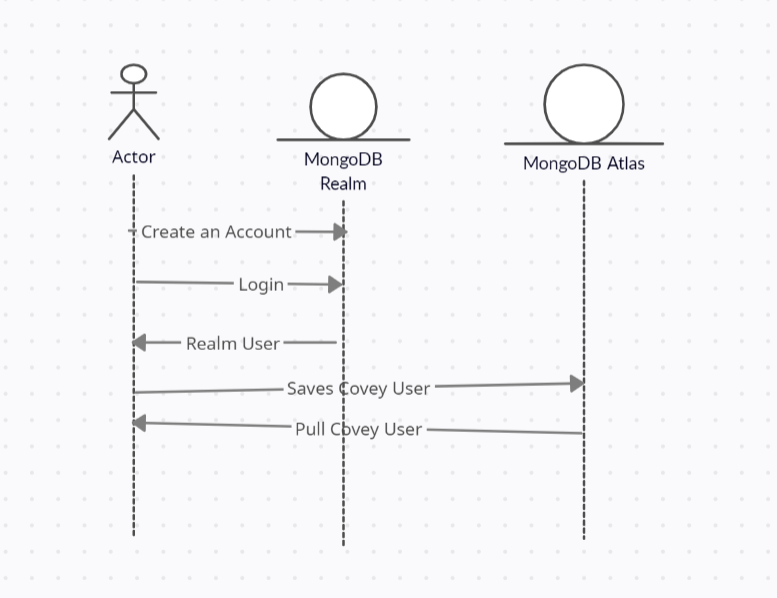
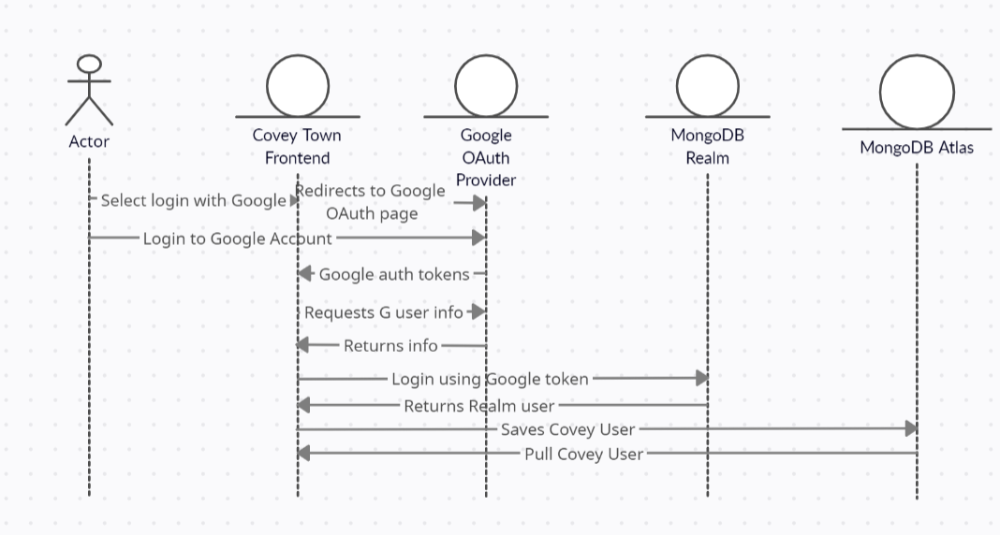
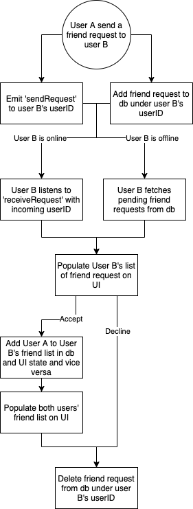

# Design

## User Story 1:
We added new types such as CoveyUser and CoveyUserProfile as abstraction for entities in covey town.

### Sign up
- Created a React component for signup page, where a user could register their email and password. All authentication requests are handled by Mongo Realm as our frontend database / authentication provider. 

### Log in
- Crated a React component to allow user to log in using their email and password, once they have registered their credentials.

### AuthGuard
- AuthGuard components stores a user's authentication info and serves as a wall that prevents unauthenticated users to access covey town app.
- Current user state is configured as react state. 

## User Story 2:

## User Story 3:
### Friend List
- Upon sign in, user's friend list is fetched from the database and populated in the UI.
- Friend list is filtered into an online and an offline list. 
- User can join a friend's room if he/she is currently online and in a room.
  - Joining a friend's room calls the same handler as joining a room.

### Add Friend:
- Upon sign in, user’s friendRequestSocket is connected and ready to listen to incoming friend requests. 
- When user A sends a friend request to user B,
  - A ‘sendRequest’ message is emitted from user A’s friendRequestSocket
    - If User B is online, his socket receives a ‘receiveRequest’ message with user A’s userID.
  - The friend request is saved into the database under user B’s userID (ie. user B has an array of userIDs from users that sent user B a friend request)
    - If User B is offline, the friend request will be fetched from the database upon his next login. 
- User B’s friend requests are populated in a list on the UI along with options to accept or reject the requests. 
  - If user B accepts the request from user A,
    - User A is added to User B’s friend list in UI state and the relationship is saved in the database and vice versa.
    - Both users’ friend lists on UI are updated accordingly. 
    - User A’s userID is removed from user B’s friend request array in the database and UI state (ie. the friend request is removed)
  - If user B rejects the request from user A,
    - User A’s userID is removed from user B’s friend request array in the database and UI state (ie. the friend request is removed)

## User Story 4:
TODO

## Realm App
- An endpoint that enables interfacing between our app and Mongo Realm. 

## Authentication
- Added an interface IAuth as an abstraction for all authentication operations.
- Created a Singleton RealmAuth class that implements IAuth. Utilizes MongoRealm as the authentication provider for the implementations.

## Database
### Frontend
- Added an inteface IDBClient as an abstraction for all database operations
- Created a Singleton RealmDBClient class which is an IDBClient implementation that utilizes MongoRealm as the database provider.
- Implements GraphQL as abstraction for MongoDB query and mutation.

### Backend
- Added an inteface IDBClient as an abstraction for all database operations.
- Created MongoAtlasClient class that opens the connection to cloud provider MongoDB Atlas and implements all IDBClient functions.

