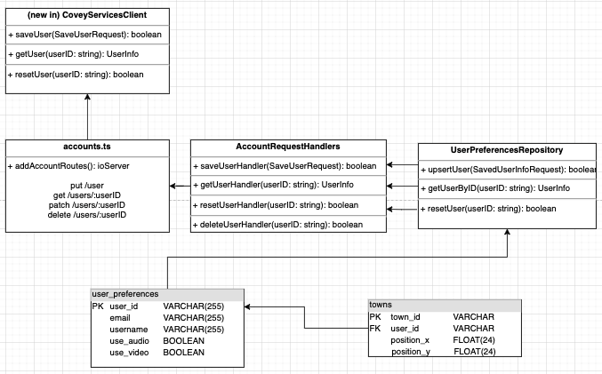

# DESIGN

## Additions to existing design
- We integrated with Auth0 to handle user authentication, including signing up, logging in, logging out, and changing a password. This change was necessary to give users the ability to create an account to save preferences and town locations. We considered implementing endpoints to create an authentication backend ourselves. However, Auth0 satisfied enough of our authentication user stories such that creating a custom authentication system seemed unnecessary.
- We added save buttons for configuring device preferences as well as saving a username. When users click the 'Saved Media' or 'Saved Name' buttons, the media and username will be disabled and set to the most recently saved user settings. If a user hasn't previously saved settings, their saved preferences are muted, hidden video, and no username by default. Users can also revert to these default settings by clicking the 'Reset Settings' button. We made these changes to allow users to save the settings they wanted to make it easier for them to join towns more easily. We chose to add a reset button for convenience, so users could have their settings wiped with the click of a button. We considered having one button for saving and applying all preferences, but we found ourselves preferring the ability to save and apply each feature separately during testing. 
- When a user is logged in and joins a town they've previously visited, they will join the town at the last location. We decided to add this change because it would allow users to pick off in the place they left off, rather than needing to walk all the way from the start position every time. We considered changing the town selection UI to exclusively include towns that the user has visited, but we thought this would limit users' exploration and promote users to prioritize only the towns they've visited rather than meeting new people.

## Backend Architecture

## Frontend Architecture
