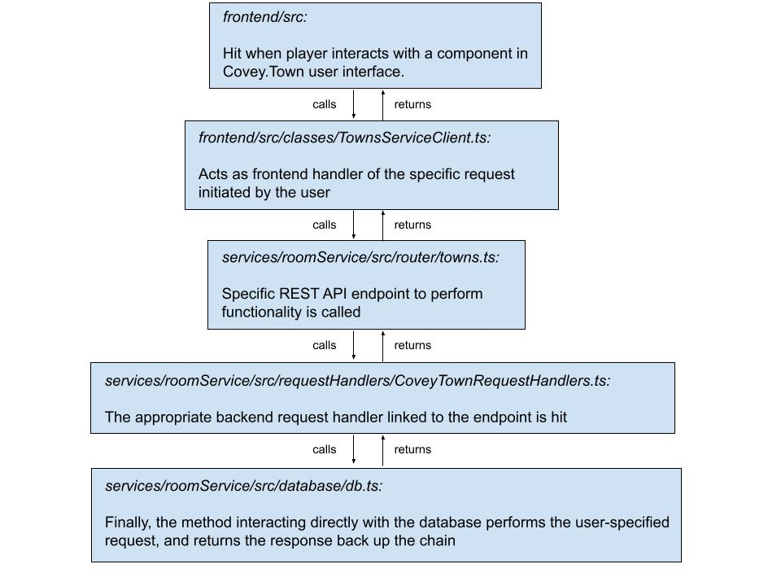

# Design

### Overview

Our project was centered around adding persistence to Covey.Town, which was accomplished through the use of a MongoDB
database. As such, the substantive changes were primarily adding in an entire database folder inside the “service/roomService”
directory to deal with connecting to this database, implementing functionality using it, and then closing it. Once new
functionality was available through this database connection, it was necessary to integrate with the existing codebase.
The resulting workflow arose:

## Backend

### Routing

The new routes added to accommodate all our proposed functionality are as follows:

### Architecture

There were many new interfaces added to structure the inputs and outputs for all our new implementation better,
but they can be generalized into 3 specific categories:

1. Requests
   - These contain the information behind who is making a request in the game, and what they are asking for.
2. Responses
   - These contain the information to be returned back to finish fulfilling the request to the user.
3. Schemas
   - These enforce some kind of structure to the data we store in our database, and it's necessary because MongoDB is a
     No-SQL database that is not as strict in enforcing this themselves.

To see how all of our work integrates into Covey Town, here is the overall architecture of the system:

### MongoDB

As seen above, the persistence we added to Covey Town was enabled through MongoDB. We instantiated a Mongo Cluster, in
which we created a database specifically to store our covey town data. Inside this database, we had 3 collections, which
each enable the 3 user stories we wished to implement:

1. user
   - User Story #1: enabling players of the game to become registered users with a username and password
2. neighbor_requests
   - User Story #2: allowing players to send "neighbor" connections to other users
3. neighbor_mappings
   - User Story #3: providing players the functionality to see which of their neighbors are online

Interaction to this database was done through using the Mongo URI specific to our cluster. Then, we added a file called
"mongodb" inside of our database folder in the backend to instantiate a connection directly to Mongo. Once this was
done, the methods inside the "db" class all were used to implement the functionality required by the 3 user stories
specified above in relation with the data we were keeping persistent. Finally, we relied upon the mongodb class once
again to close the connection when the application was to be closed.

### Conclusion

So most of this project was about additions to the functionality of Covey Town, but it did come with one change: players
must create an account in order to enter and interact with the game. We justified this choice by believing that every
single user of the application should be able to enter into our rich network of neighbor connections to make their
in-game experience more social.

## Frontend

### Changes

We made two changes to the codebase, along with a couple additions to the frontend.

1. Added `LoggedInID` to the CoveyAppState type. This allowed us to keep track of the current logged in user's ID and
   username, which we used in the NearbyPlayersList modal in game.
2. We removed the original username component, requiring users to input both a username and password. Additionally, since
   we were adding persistence, we gave two options: sign-up or log in. This is shown in the Features.MD file in more detail.

### New Features

In addition to these changes, we added multiple new features such as:

1. A search box that shows up after a user is logged in. This uses a new route `/users/:currentUserId/:username`, to list
   either the user with that specific username or any user whose username starts with the search term.
2. An account page that displays after a user is logged in.

More about the functionality for these particular components can be found in the Features.MD documentation.
