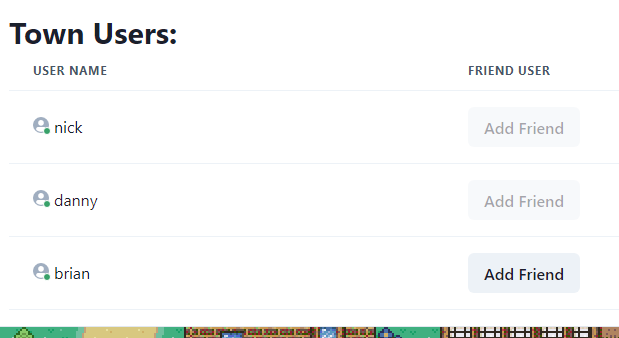
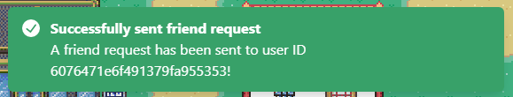

# Features

## User Story 1:

## User Story 2:

## User Story 3:
# Friend List:
- Upon sign-in, user can see a list of their friends on the landing page. Online and offline users are separated into two different lists.
- If a friend is online but not in a town, they show up as “in lobby.” If they are in a specific town, user can choose to join their town.
# Add Friend:
- To add friend, user needs to obtain the other user’s ID, which should be shown right below their add friend box. User will paste the userID into the “Add Friend” text box and press “Send friend request.” A confirmation toast should appear confirming the friend request was sent successfully. 
- Once a friend request is sent, the other user should see a pending friend request with options to accept or reject the request. 
- If the user accepts the request, the request should disappear and the requester should be added to their friend list. Friend relationship persists through the following sessions. 

## User Story 4:
### Town User List:
Once a user has joined a town, at the top of the screen (above the displayed “world map”), the user will see a list of all users in the town, excluding themselves. If they are alone in the town, the list will look as follows:

The profile picture and name for each town user are displayed on each row of the list. As new users join the town, they will be added to this list. If a user who is friends with both “nick” and “danny”, but not “brian” joins the room,they will see the below Town User list:

### Add Another Town User as a Friend:
To add another user in the town as a friend, the logged in user should click on the “Add friend” button next to the desired friend in the Town Users list. If the user is already friends with another user in the town (meaning that either friend has already accepted a friend request), this button will be greyed out for the row with the friend(s) names. Once an “Add Friend” button is clicked, a confirmation toast will appear confirming the friend request was sent successfully:

Once the receiver of the friend request next returns to the Town Selection page, they will see the incoming friend request with the name of the requestor in their Friends List where they can accept or reject it. As soon as a new friend request is accepted, the next time either friend joins a town together is when they will see the “Add Friend” button as disabled. 

