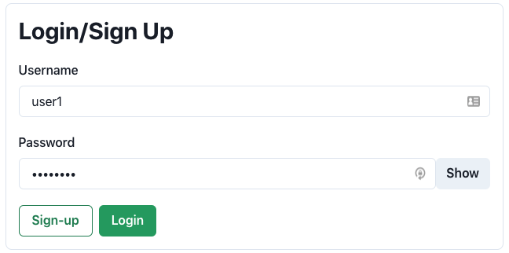

# Features

### Profile - Signing Up and Logging In
The first feature that has been added is the ability to sign up for a profile and log in during future uses.
On the initial page, the "Your name" input has been modified and now asks for a username and password. Once
the user has inputted these values, they can click Sign-Up or Login.

Note: If the username already exists, the new user will have to choose a different username.

### Searching for and Adding Neighbors

### Interacting with Neighbors
