# Features

## To interact with our updated version of Covey.Town, load our [netlify](https://xenodochial-nightingale-f7c426.netlify.app/) page!

### You will see a Login button where you can sign in on the top right corner of the page.

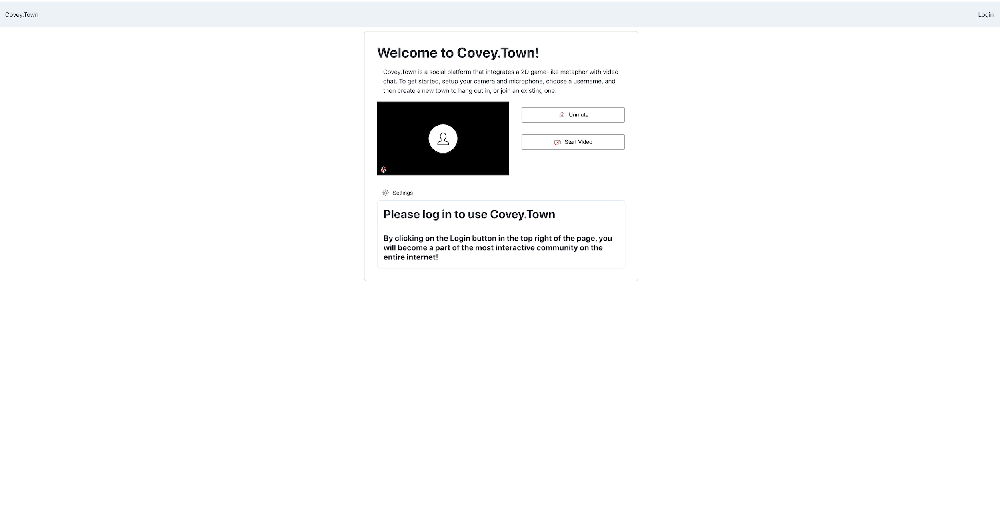
Click Login on the top right which will direct you to Auth0.

### Either sign up with a new account or use Google to authenticate. If you have an existing account, you may sign in.

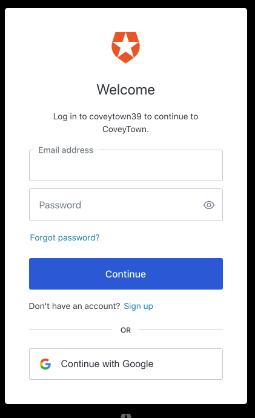

1. New Account
   Enter email and new password.
   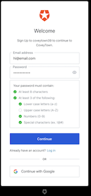 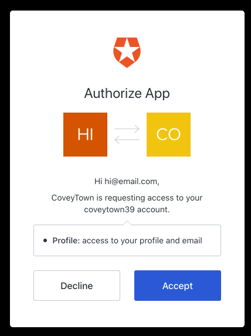
2. Existing Account (Click continue after entering email and password.)
   
3. Google sign-in (You may see either)
   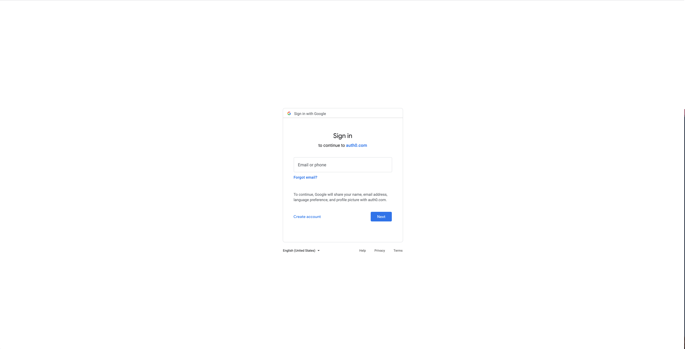 Or: 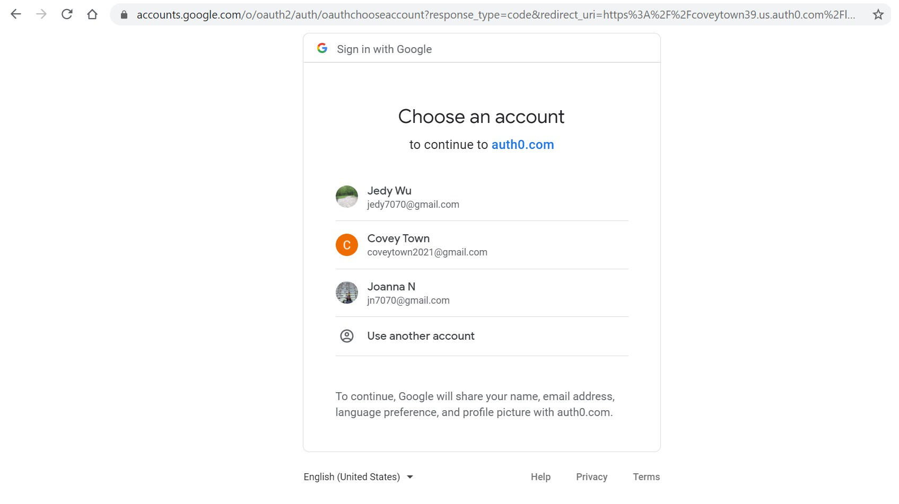

### After login, you should see the main page:

### Enter profile details

Initial Profile is created when signing up or joining through Google with username and email immutable.
You can create and update a profile seen below by clicking edit and then save.
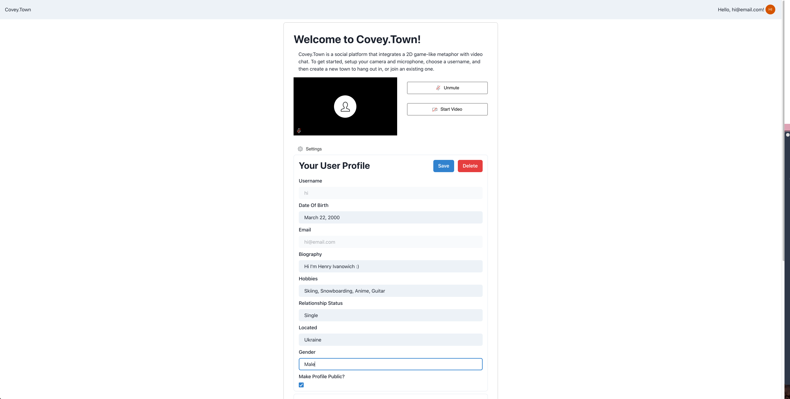 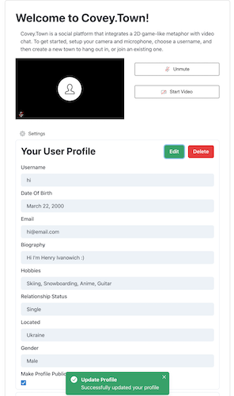

Click delete if you want to delete your user/user profile.
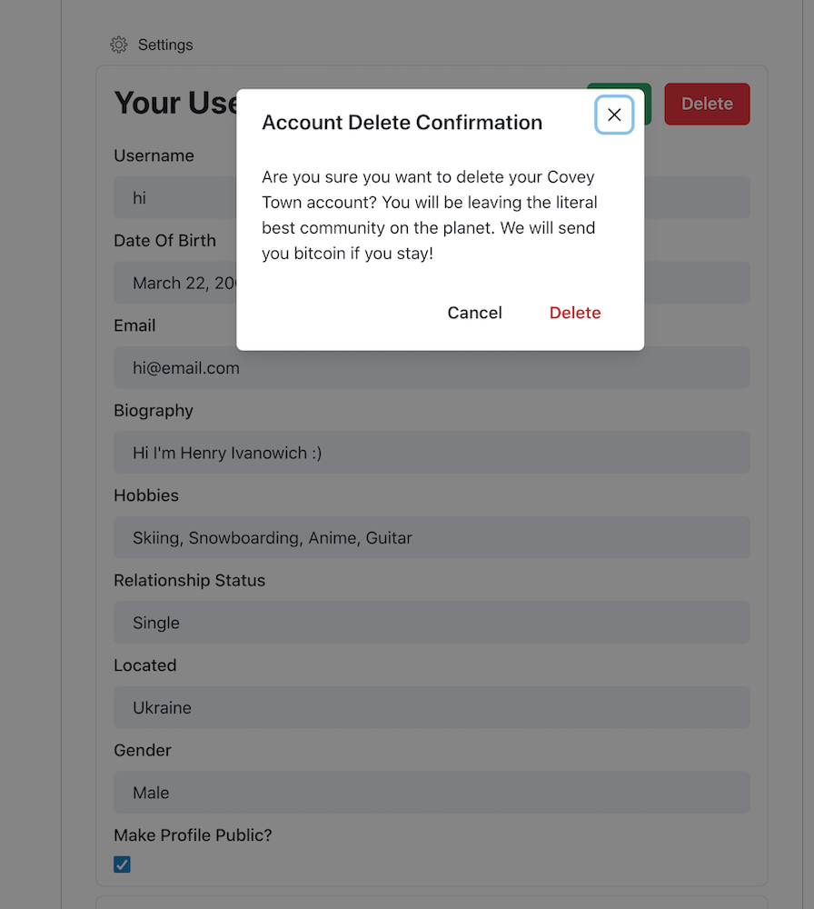 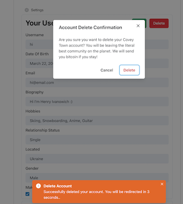

### You may now join a town or create a new town OR create/join a town without modifying your user profile.

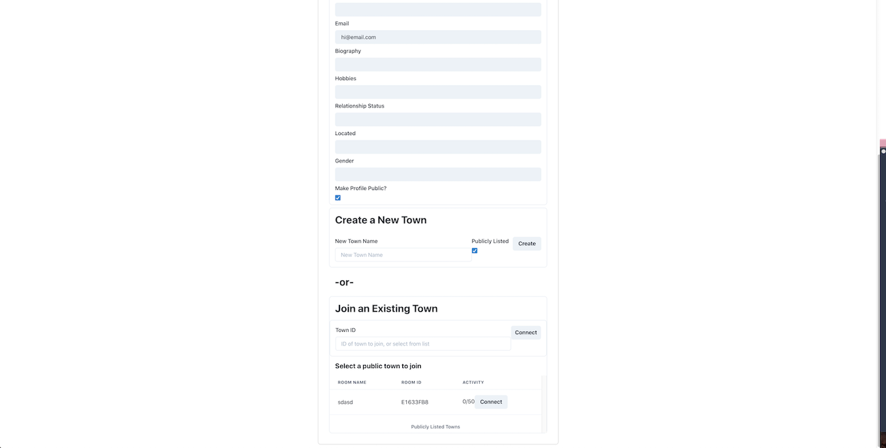

### If you want to sign out, click your name on the top right corner, then click Logout.

### You will be redirected back to Login Page.

