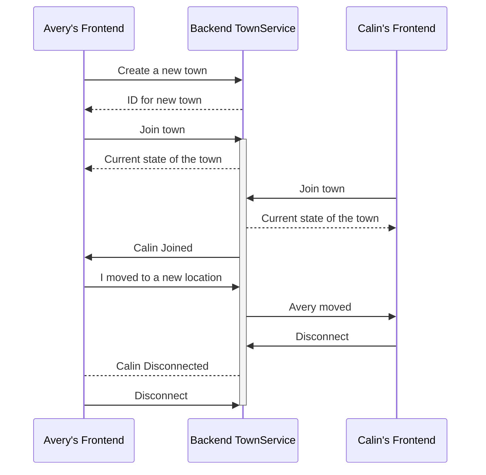
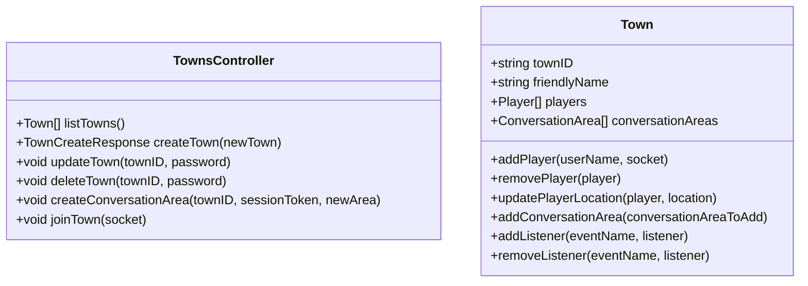
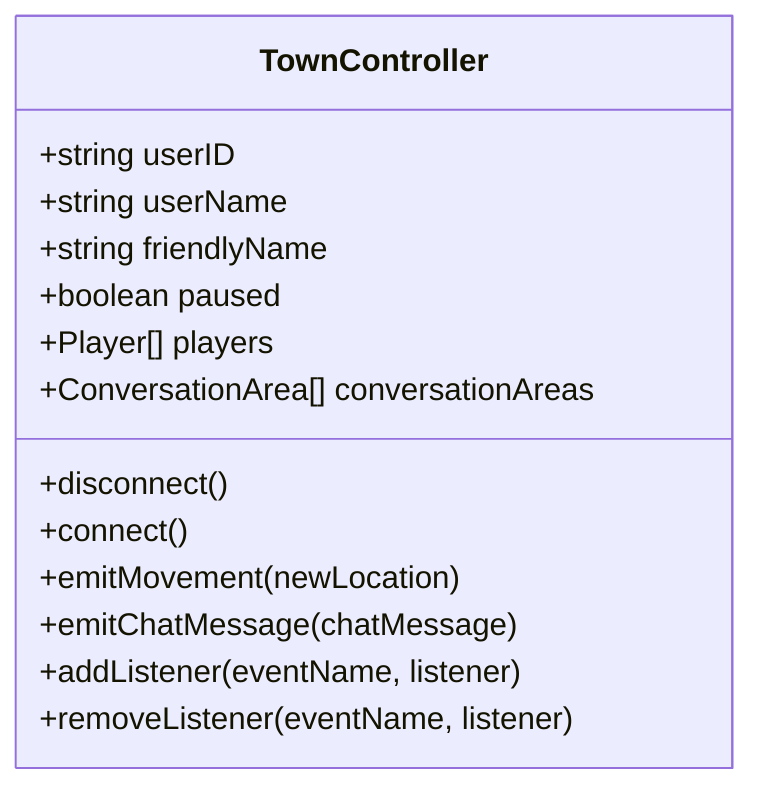
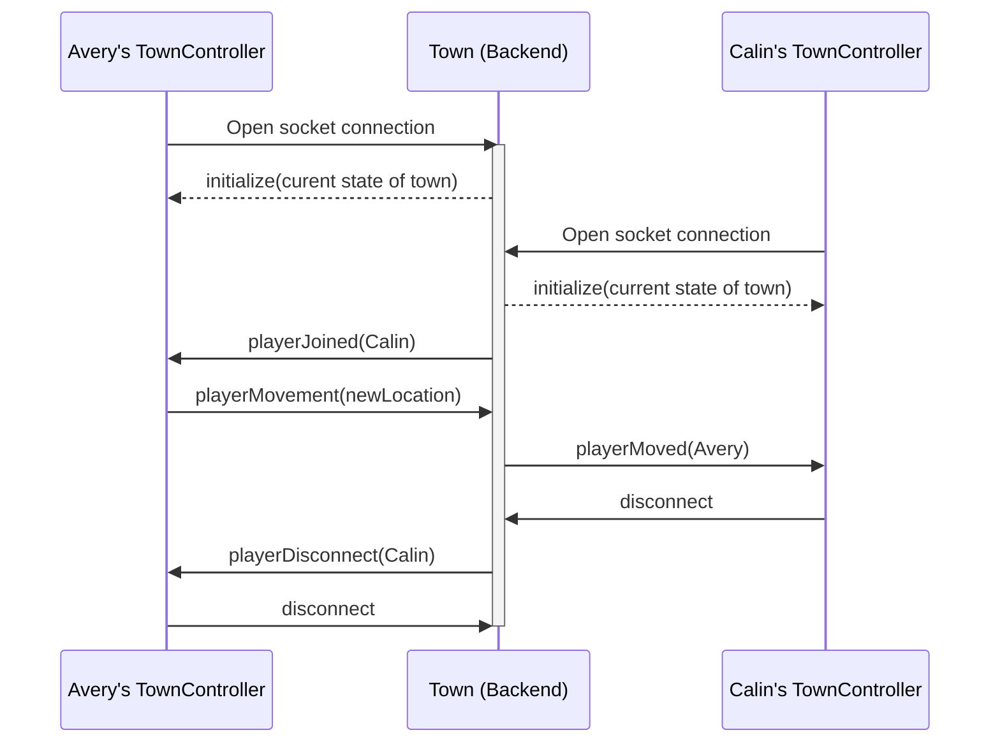
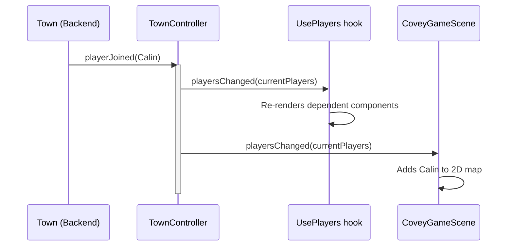

# Overall Design

This application uses an event-oriented architecture to share information and implement the application logic. One way to think of the application is as a set of frontend instances (browser tabs connected to the application), and a backend TownService.

The sequence diagram below shows the kinds of high-level events that occur in the application, assuming that there are two frontends connected:



## Key components

### Backend

The `TownsController` implements the REST protocol and also sets up new socket connections. The `Town` class maintains the state for each active town.



### Frontend



## Event flows

### Before joining a town

Before a user connects to a town, all communication between the frontend and the backend occurs over the `towns` REST API, which is described and implemented in `townService/src/town/TownsController.ts`. The API is accessed in React code through the `townService` property of the `LoginController`.

### While in a town

While a user is in a town, communication between the frontend and the backend occurs primarily over the socket API. The events that are shared over the socket protocol are defined in `shared/types/CoveyTownSocket.d.ts`:

```ts
export interface ServerToClientEvents {
  playerMoved: (movedPlayer: Player) => void;
  playerDisconnect: (disconnectedPlayer: Player) => void;
  playerJoined: (newPlayer: Player) => void;
  initialize: (initialData: TownJoinResponse) => void;
  townSettingsUpdated: (update: TownSettingsUpdate) => void;
  townClosing: () => void;
  conversationAreaUpdated: (conversationArea: ConversationArea) => void;
  conversationAreaDestroyed: (conversationArea: ConversationArea) => void;
  chatMessage: (message: ChatMessage) => void;
}

export interface ClientToServerEvents {
  chatMessage: (message: ChatMessage) => void;
  playerMovement: (movementData: PlayerLocation) => void;
}
```

This protocol is implemented on the backend in `townService/src/town/Town.ts`, and on the frontend in `frontend/src/classes/TownController.ts`. The types that are shared over the socket are simple structs (serializing TypeScript classes is non-trivial), and the protocol is designed to minimize the size of messages - it only includes the entire state of the town in the `initialize` response, and sends diffs otherwise.

For example, this diagram shows the same sequence of events above from "Join Town", showing only Avery's frontend and the backend:



#### TownEvents in the frontend

The frontend TownController tracks the current state of the town, applying updates as they are sent by the server, and exposes a different event format, `TownEvents` that other frontend components can subscribe to. For convenience when using React components, there are also a variety of React hooks available, which can be used to subscribe to application state, triggering a re-render when that state changes.

For example, this diagram demonstrates the flow of events:


